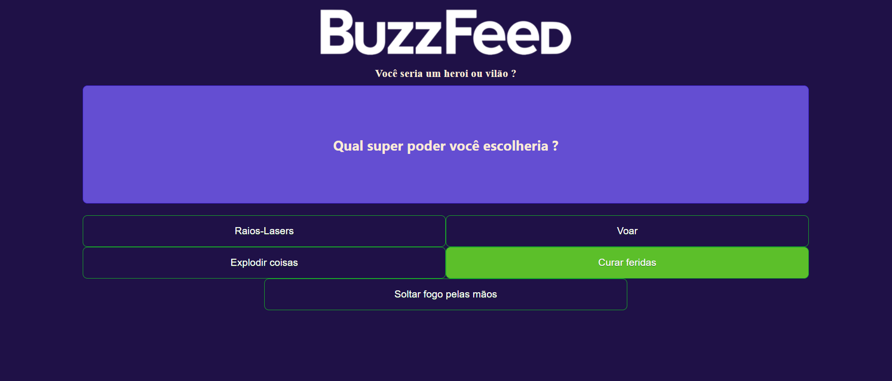
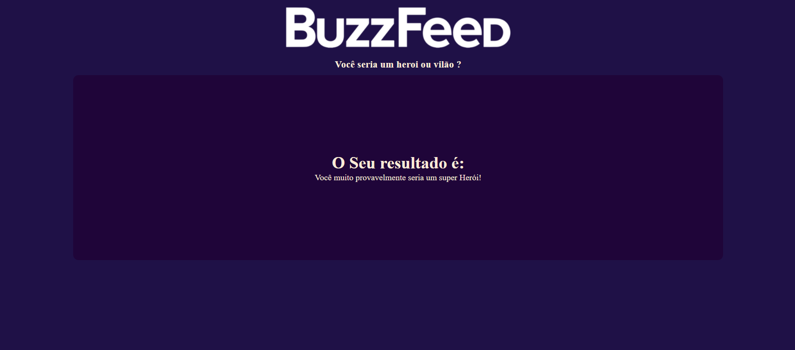

# 👾 Projeto BuzzFeed

Este repositório corresponde ao Desafio 05 do Bootcamp Decola Tech Avanade 2025 🧡 para fornecer instruções sobre como construir um clone do BuzzFeed Quizz com Angular 14.

## 🔗 Link para o repositório original
https://github.com/felipeAguiarCode/angular-buzzfeed-quizz-clone

## 💻 Servidor de desenvolvimento

Execute  `ng serve`  para iniciar um servidor de desenvolvimento. Navegue até `http://localhost:4200/`. A aplicação será recarregada automaticamente se você alterar qualquer um dos arquivos de origem.

## 🖨 Imagens do projeto

